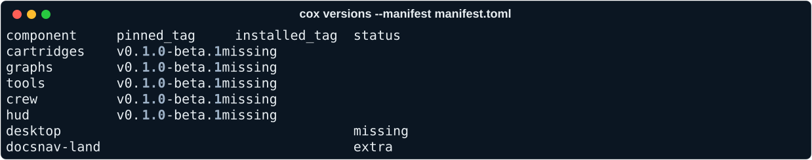
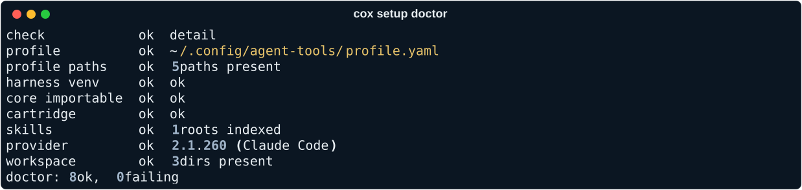

# Install

How to install the components pinned by `manifest.toml` with the `cox`
command.

```sh
curl -fsSL https://raw.githubusercontent.com/ppfenning/coxswain/main/install.sh | sh -s -- --provider claude-code --with hud
```

## What it does

1. Reads `manifest.toml` from the pinned release to find out which
   components exist and which tag they share.
2. Installs `uv` if it isn't already on `PATH` — `uv` is what the rest of
   the install uses to fetch and run Python tooling.
3. Fetches the required components (cartridges, graphs, `cox` itself) at
   their pinned tag into `--root`.
4. Fetches whichever optional components `--with` named (crew, HUD,
   desktop) at the same tag.
5. Writes the provider config for `--provider`, so `cox` knows which CLI,
   plugin, and model tiers to use.

## Flags

| Flag | Meaning |
| --- | --- |
| `--provider` | Which provider profile to configure (see [Providers](providers.md)). |
| `--with crew\|hud\|desktop` | Optional components to install alongside the required ones. Repeatable. |
| `--root` | Where to install components. Defaults to a path under your home directory. |
| `--team` | Which team's cartridge to pull in, if you belong to more than one. |
| `--workspace` | The workspace root the crew will operate on. |
| `--version` | Install a specific Coxswain version instead of the latest release. |
| `--dry-run` | Print what the installer would do without doing it. |

## Verify

```sh
cox doctor
```

`cox doctor` checks that every required component is present, pinned to the
version `manifest.toml` expects, and that the configured provider's CLI is
reachable on `PATH`.

## What you'll see



`cox versions` lists every component next to the tag `manifest.toml` pins, so drift is visible before you upgrade.



`cox setup doctor` is what the checks above look like against a real install.

## Upgrade

```sh
cox upgrade
```

`cox upgrade` re-reads the manifest for the latest release and moves every
pinned component to the new tag in lockstep.

## Uninstall

There is no `cox uninstall` yet. Removing an install means deleting
`--root` by hand; a dedicated uninstall command is planned.

See [Supported machines](machines.md) for prerequisites on specific
platforms.
