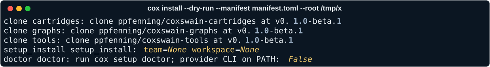

# Supported machines

Every platform below needs the same three things before you run the
installer: `git`, `curl`, and a Python 3.11 or newer for `uv` to use. You
don't need to install `uv` yourself — the install script installs it if it
isn't already on `PATH`.

## Arch and Omarchy

`git`, `curl`, and Python 3.11+ are in the official repos: `pacman -S git
curl python`. Omarchy ships all three by default, so on a stock Omarchy
install there is nothing to do before running the installer.

## Debian and Ubuntu

Recent releases ship Python 3.11+ already. On older releases, install it
from `deb.nodesource.com`-style backports or `deadsnakes` before running the
installer, since the system `python3` may be too old for `uv` to use.
`apt install git curl python3` covers the rest.

## macOS

`git` ships with the Xcode Command Line Tools (`xcode-select --install`).
`curl` is preinstalled. Get a current Python with `brew install python@3.11`
if the system one is older.

## Proxmox LXC

Use an unprivileged container with a current Debian or Ubuntu template, and
follow the Debian and Ubuntu prerequisites above. Nesting isn't required —
the installer doesn't need a container runtime, just the three prerequisites
and network access to GitHub.

## Docker clean room

For a disposable, fully isolated install, run the installer inside a
container built from a Debian or Ubuntu base image with `git`, `curl`, and
Python 3.11+ installed. This is the fastest way to try Coxswain without
touching the host machine at all.

## What you'll see

`cox install --dry-run` prints the same plan the installer would run, before it writes anything under `--root`.
