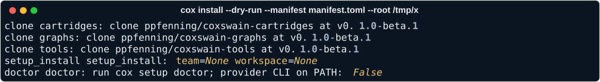

# Supported machines

Every platform below needs `git` and `curl` before you run the installer.
Coxswain needs Python 3.14 or newer; `uv` downloads a managed Python 3.14
when the system one is older, so you don't need to install it yourself. You
don't need to install `uv` either — the install script installs it if it
isn't already on `PATH`.

## Arch and Omarchy

`git` and `curl` are in the official repos: `pacman -S git curl`. Omarchy
ships both by default, so on a stock Omarchy install there is nothing to do
before running the installer.

## Debian and Ubuntu

`apt install git curl` covers the prerequisites. The system `python3` is
usually older than 3.14, which is fine: `uv` downloads its own.

## macOS

`git` ships with the Xcode Command Line Tools (`xcode-select --install`).
`curl` is preinstalled. `uv` downloads Python 3.14 if the system one is
older, or install it with `brew install python@3.14`.

## Proxmox LXC

Use an unprivileged container with a current Debian or Ubuntu template, and
follow the Debian and Ubuntu prerequisites above. Nesting isn't required —
the installer doesn't need a container runtime, just the two prerequisites
and network access to GitHub.

## Docker clean room

For a disposable, fully isolated install, run the installer inside a
container built from a Debian or Ubuntu base image with `git` and `curl`
installed. This is the fastest way to try Coxswain without
touching the host machine at all.

## What you'll see

`cox install --dry-run` prints the same plan the installer would run, before it writes anything under `--root`.
