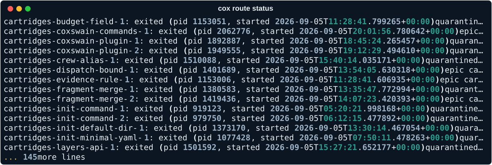

# Start here

Coxswain is the umbrella for the agent platform. It is not itself an agent:
this repository holds the docs you're reading, `manifest.toml` (the file that
pins every other component to the same version, in lockstep), the one-line
installer, and the release notes. The components it pins do the work: a
cartridges repo, a graphs repo, the `cox` CLI, and an optional crew add-on.

Coxswain is **beta**. See [What beta means](#what-beta-means) below before
you rely on it for anything you can't afford to redo by hand.

## The loop

Every change a crew makes goes through the same loop. [See it as a
diagram](loop.md).

Work arrives as **intake**: a ticket, a bug report, a request from a human.
The coxswain **dispatches** it, but only within the in-flight bound — a cap
on how many runs are active at once, so the crew doesn't take on more than it
can review. Once dispatched, a **run** plans the work, **builds** it, and is
**reviewed** twice over: once against the team's charter (the style and
correctness rules a reviewer holds work to) and once by an adversary looking
for what the charter reviewer missed. The two reviews are **arbitrated**
into a single verdict, the result is **validated** against the checks the
project actually runs, and the change **lands on a branch**. From there it
becomes a **pull request**, and a human — or CI, or both — decides whether it
**merges on green**.

No step in that loop writes to the system of record except the one that owns
it. See [conventions: single writer](../methodology/index.md) for why.

## What you'll see

`cox route status` shows which provider and model tier a run will use before it starts.

## Vocabulary

- **crew** — the agents that do the rowing: they plan, build, review, and
  validate. The coxswain steers; the crew rows.
- **seat** — one role in the crew, filled by one agent doing one job on one
  run: builder, charter reviewer, adversary, arbiter, validator.
- **coxswain** — the component that dispatches work to the crew and enforces
  the in-flight bound. It never does the crew's work itself.
- **cartridge** — a packaged bundle of context for a team or a repo: its
  conventions, its charter, its thresholds. Pinned in `manifest.toml` like
  everything else.
- **fragment** — one piece of context text — a convention, a charter, a
  style note — that gets assembled into a seat's prompt for a run.
- **graph** — the ordered set of nodes a run executes: plan, build, review,
  arbitrate, validate, and so on. Defined once, reused by every run.
- **phase** — an ordered stage inside an epic. Tickets within a phase aren't
  necessarily ordered against each other; phases are.
- **task** — one unit of work: one ticket, one pull request. If a task needs
  three PRs, it was really three tasks.
- **run** — one execution of a graph against one task, from intake to
  landing on a branch.
- **docket** — the queue of tasks waiting to be dispatched, respecting the
  in-flight bound.
- **ledger** — the record of what a run did: the evidence, the verdicts, the
  patch. What a human reads to decide whether to trust the result.

## What beta means

Versions may change between releases — a flag, a file layout, a component's
shape can move without a deprecation cycle. What doesn't move is the pin:
every component in a given Coxswain release is tagged with that release's
version, so `manifest.toml` always tells you exactly what you have, even
while beta is still settling.
