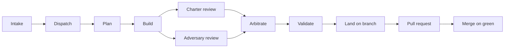

# The loop

The same loop described on the [Start](index.md) page, as a diagram. Each
node below is one stage a task passes through, in order.

**Intake.** A ticket, a bug report, or a request enters the docket. Nothing
runs yet — intake only records that the work exists and is scoped enough to
plan.

**Dispatch.** The coxswain picks the next task off the docket and starts a
run for it, but only if doing so stays within the in-flight bound. The
coxswain is the only thing that writes to the docket's state.

**Plan.** The run breaks the task into an ordered set of steps and names the
files it expects to touch, so the reviewers downstream have a boundary to
check the work against.

**Build.** A builder seat does the work in a disposable worktree and
produces a patch. It never applies the patch anywhere itself.

**Charter review.** A reviewer seat holds the patch against the team's
charter: its style, its conventions, its correctness rules.

**Adversary review.** A second reviewer seat looks at the same patch for
what the charter review's frame wouldn't catch: edge cases, missing tests,
claims without evidence.

**Arbitrate.** The two verdicts are reconciled into one. Disagreement
between them is a finding in itself, not something averaged away.

**Validate.** The patch is checked against the project's own commands — the
ones it actually runs, not a description of them.

**Land on branch.** Once validated, the patch is applied to a branch. This
is the first point in the loop where anything is written outside the
disposable worktree.

**Pull request.** The branch becomes a pull request, carrying the ledger of
what happened as evidence for the human who reviews it.

**Merge on green.** The pull request merges once its checks pass. Nothing
upstream of this step is a system of record; this is where the change
becomes one.
